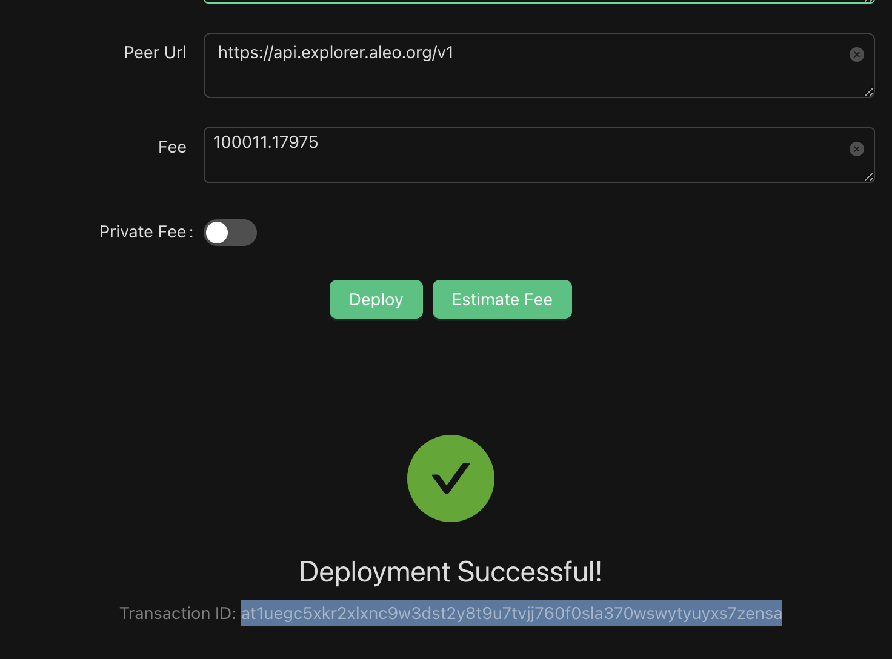

# Aleo Challenge

Submission for Aleo code challenge 

## 1 - Test mapping, transitions
```
leo run mint_public aleo12ayekfmpzfvsq3gq5smnvgtsh7pskwg3nfcht5nmxh6m5ayywygs52yshu 24u64 "{user_profile: aleo12ayekfmpzfvsq3gq5smnvgtsh7pskwg3nfcht5nmxh6m5ayywygs52yshu, signal: 24u64}"
```

## 2 - Test struct 
```
leo run set_user_profile aleo12ayekfmpzfvsq3gq5smnvgtsh7pskwg3nfcht5nmxh6m5ayywygs52yshu "{user_profile: aleo12ayekfmpzfvsq3gq5smnvgtsh7pskwg3nfcht5nmxh6m5ayywygs52yshu, signal: 24u64}"
```
## 3 - Test private record 
```
leo run mint_private aleo12ayekfmpzfvsq3gq5smnvgtsh7pskwg3nfcht5nmxh6m5ayywygs52yshu 24u64
```

## 4 - Deploy Aleo program 
```
leo deploy --endpoint https://api.explorer.aleo.org/v1 --private-key APrivateKey1zkpJcQTMcYu5SDxBM9PdjaD9oVqb2S6TwS918fz4zh5dabC
```

### Deployment Result
```
Transaction ID: at1uegc5xkr2xlxnc9w3dst2y8t9u7tvjj760f0sla370wswytyuyxs7zensa
```




